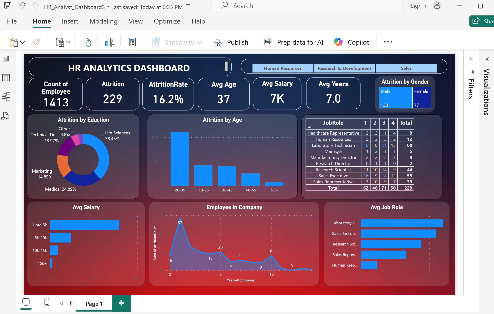
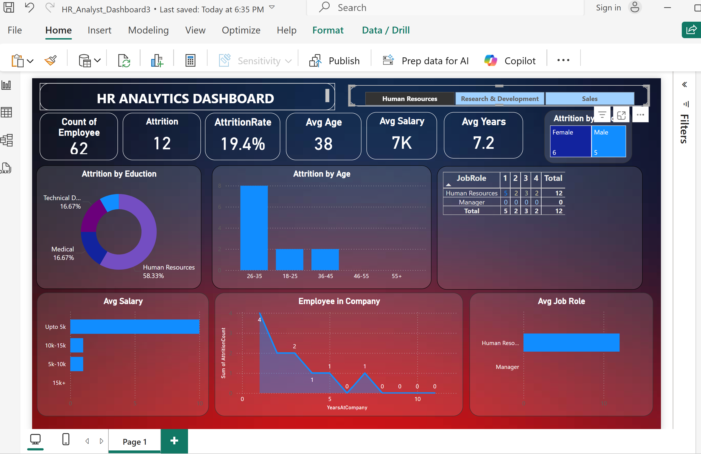

# HR Analytics Dashboard

An interactive Power BI dashboard designed to provide insights into HR metrics such as employee demographics, attrition rates, and departmental distributions.

## 📊 Project Overview

This project leverages Power BI to visualize and analyze HR data, aiding stakeholders in making informed decisions regarding workforce management.

## 📁 Repository Contents

* **HR\_Analyst\_Dashboard3.pbix**: The Power BI dashboard file containing visualizations and data models.
* **HR\_Analytics.csv**: The dataset used for creating the dashboard.
* **dashboard1.png** & **dashboard2.png**: Screenshots showcasing the dashboard's visualizations.

## 🚀 Getting Started

1. **Clone the Repository**:

   ```bash
   git clone https://github.com/hammadshah18/HR_Analatics_Dashboard.git
   ```

2. **Open the Dashboard**:

   * Ensure you have [Power BI Desktop](https://powerbi.microsoft.com/desktop/) installed.
   * Open the `HR_Analyst_Dashboard3.pbix` file using Power BI Desktop.

## 🖼️ Dashboard Previews


*Figure 1: Overview of HR Metrics*


*Figure 2: Detailed Employee Analysis*

## 📌 Features

* **Employee Demographics**: Analyze age, gender, and education distributions.
* **Attrition Analysis**: Identify trends and factors contributing to employee turnover.
* **Departmental Insights**: Evaluate performance and metrics across different departments.
* **Interactive Filters**: Drill down into specific segments for detailed analysis.

## 🛠️ Tools & Technologies

* **Power BI**: For creating interactive visualizations and dashboards.
* **CSV**: Data source format for easy integration and analysis.

## 📬 Contact

For questions or feedback, please reach out to [hammadshah18](https://github.com/hammadshah18).

---

